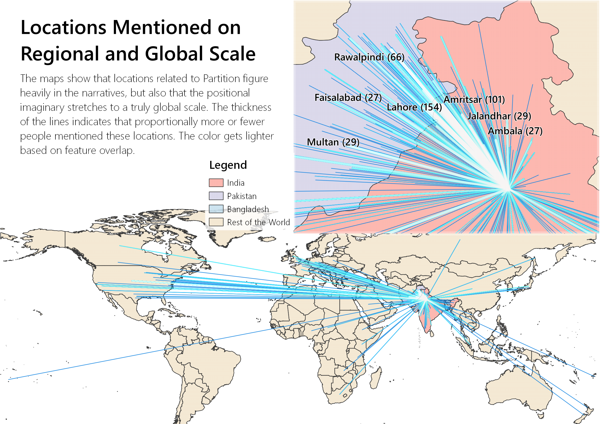
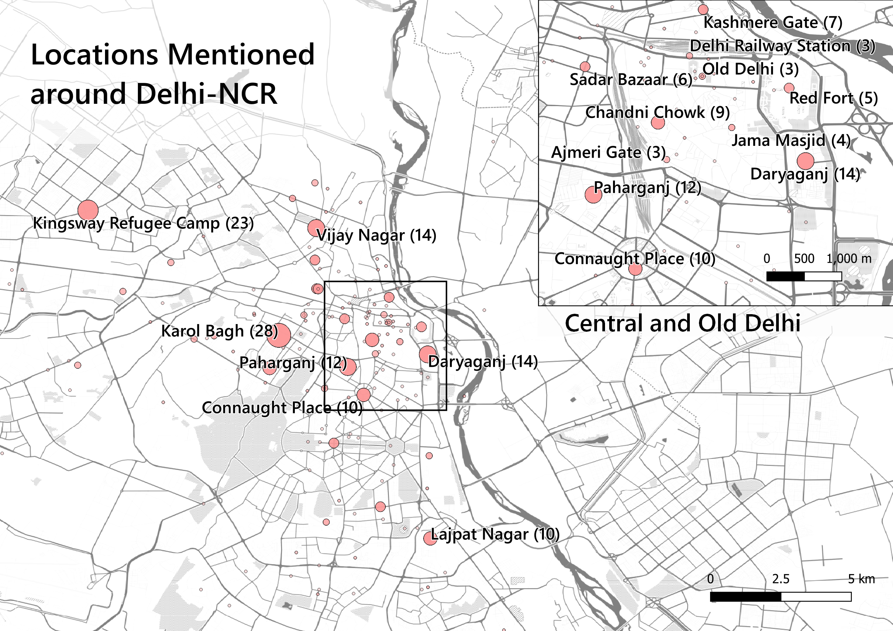

```{r setup, include=FALSE, messages = FALSE, warning=FALSE, error=FALSE}
knitr::opts_chunk$set(echo = TRUE, message = FALSE, warning=FALSE, error=FALSE)
```

## Introduction

The documentation below is the white paper for the essay: "Partitioned Narratives: Thick Mapping the *1947 Partition Archive*." It includes the R code and csv files necessary to reproduce the calculations. Some of the spatial manipulations were performed in QGIS 3.16 (Hannover). Images of the results have been provided to complement the paper. Some steps involved converting CSV files to Geopackage files, as this is a common GIS workflow it has been skipped.

## Part 1: Priming the NER Extracted Data

#### Load packages 

The following packages: `tidyverse`, `tidygeocoder`,`tidytext`,`stringi`,`htmlTable`, are necessary to run this script.

```{r load_packages}
library(tidyverse)
library(tidygeocoder)
library(tidytext)
library(stringi)
library(htmlTable)
library(ggplot2)
library(scales)
```


#### Load location data

The loaded csv file is a cleaned up version of the one that results from scraping and running the data through NER. The cleaning process mostly involves removing false positives, consolidating similar locations (i.e. Bombay and Mumbai), and removing any corrupt data. This process also included coding the gender of the interviewee and whether a person mentioned their occupation. Finally, for less known or ambiguous locations we added the city and district to aid the geotagger. 

```{r load_partition_locations}
partition_df <- read_csv("data/post_clean_locations.csv", na = c("", "NA"))
```


#### Reformat `partition_df`

The following procedure primes the data for analysis:

* An address field is created by uniting the location, city, and country field
* Remove unnecessary strings from data fields
* Drop unnecessary columns
* Keep all distinct addresses by person name. This prevents double counting locations in a person's account


```{r reformat_partition_df}
partition_distinct_locations <-  partition_df %>%
  group_by(name) %>%
  #create address field from locations, city, and country columns
  unite("address",
        locations:country,
        sep = ", ",
        na.rm = TRUE) %>%
  #remove unnecessary text and add total locations column
  mutate(
    age = str_remove(age, "Age in 1947: "),
    migrated_from = str_remove(migrated_from, "Migrated from: "),
    migrated_to = str_remove(migrated_to, "Migrated to: "),
  ) %>%
  #drop unnecessary columns
  select(name:migrated_to, gender:address) %>%
  #keep all distinct addresses. This helps reduce the query time for the geocoder.
  distinct(address, .keep_all = TRUE) %>%
  ungroup()
```

## Part 2: Geocoding

#### Find distinct addresses

The geocoding the addresses can be quite time consuming. To save time, we can run only the distinct addresses and then join these back to `partition_distinct_locations` afterwards.

```{r distinct_addresses}
#create a vector of distinct addresses
addresses <- partition_distinct_locations %>%
  distinct(address)
```

#### Run geocoder

The script relies on the `tidygeocoder` package developed by Jesse Cambon, Diego Hernangómez, Christopher Belanger, Daniel Possenriede: [tidygeocoder](https://jessecambon.github.io/tidygeocoder/index.html). The package allows users to select the geocoder of their choice. For the purposes of easy reproduceability OpenStreetMap (`osm`) was selected, though other services that require registration or login might be more accurate. This process is time consuming and has been commented out. The address file has been cached.

```{r run_geocoder, cache=TRUE, eval=FALSE}
#Because the processing time is quite lengthy, this has been commented out. When running custom data remove the comment.

#addresses_geocoded <- geo(addresses$address, method = 'osm', full_results = FALSE)
```

*Note: the geocoding has been skipped. Instead the saved locations are read in as a csv file*

```{r}
addresses_gecoded <- read_csv("data/addresses_geocoded.csv")
```


#### Join coordinates to `distinct_partition_locations` 

The coordinates are joined to the existing dataframe `distinct_partition_locations`.

```{r join_coordinates}
partition_geolocations <- partition_distinct_locations %>%
  left_join(addresses_gecoded)
```

#### Clean final table

The geocoder will not necessarily catch all locations. Some of the locations have to be geocoded and corrected manually. This process is involved, and has to be done through QGIS. Several additional fields were created to keep track of the changes: 

* *known* - Whether the location was ultimately found. FALSE indication that the location is a best guess

* *camp* - Indicates that this was a refugee camp. This data was not used

* *resolved_location* - The final location name for the coordinate. There may be a discrepancy between this and the initial address

* *admin* - Indicates whether this a larger administrative area within which other locations fall. It also includes rivers. Admin areas are dropped from analysis because they are redundant. Likewise, as the position of the river is often unknowable, this too was dropped.

```{r create_raw_locations}
write_csv(partition_geolocations,
          "data/partition_geolocations_raw.csv")
```


## Part 3: Statistical Overview

#### Import clean data

Read in the data file `partition_geolocations_clean`. This file is *read-only* to prevent accidental file corruption.

```{r read_clean_locations, results='hide'}
partition_clean <-
  read_csv("data/partition_geolocations_clean.csv", na = "NA")
```


```{r create_data_labels, echo=FALSE}
#This is not a necessary step, but it helps make for cleaner charts.
partition_clean$occupation <- factor(partition_clean$occupation,
                                     labels = c("No", "Not Mentioned", "Yes"))

partition_clean$gender <- factor(partition_clean$gender,
                                 labels = c("Female", "Male"))
```


#### Aggregate location totals

Generate a table for all analysis: only include non-administrative areas, unique locations for each person, counts per person, and total counts per location. 

```{r add_location_totals}
partition_statistics <- partition_clean %>%
  rename(latitude = 9) %>%
  rename(longitude = 10) %>%
  filter(admin == FALSE) %>%
  filter(occupation != "No") %>%
  #Generating a unique personID helps maintain avoid double counting of people with the same name.
  mutate(PersonID = paste(name, "_", age)) %>%
  group_by(PersonID) %>%
  distinct() %>%
  add_count(PersonID, name = "loc_by_name") %>%
  ungroup() %>%
  add_count(resolved_location, name = "loc_total")
```

#### General Overview

```{r general_overview, echo= FALSE}
#Get number of unique locations

unique_locations <- partition_statistics %>%
  ungroup() %>%
  select(resolved_location) %>%
  distinct() %>%
  nrow()

#Get number of unique people
unique_people <- partition_statistics %>%
  ungroup() %>%
  select(gender, age, name) %>%
  distinct() %>%
  nrow()


#Ratio of men and women.
men_women <- partition_statistics %>%
  distinct(name, age, gender) %>%
  count(gender)

#Calculate mean locations mentioned
mean_locations <- partition_statistics %>%
  ungroup() %>%
  summarize(mean_locations = mean(loc_by_name))
```

There are `r unique_locations` unique locations in the data set. These are distributed across `r unique_people` people (men = `r men_women[2,2]`, women = `r men_women[1,2]`). On average, each person mentions `r round(mean_locations,2)` locations. 

#### Locations by gender

Broken down by gender, it is clear that the mean number of locations by men is higher than that of women.


```{r locations_by_gender, message=TRUE}
mean_locations_gender <- partition_statistics %>%
  group_by(gender) %>%
  summarize(mean_gender = round(mean(loc_by_name), 2))

mean_locations_gender %>%
  addHtmlTableStyle(col.rgroup = c("none", "#F5FBFF"),
                    pos.caption = "bottom") %>%
  htmlTable(header = c("Gender", "Mean Locations Mentioned"),
            caption = "Table 1: Mean Locations Mentioned by Gender")
```

#### Locations by occupation

A similar trend emerges when accounting for occupation. Here, people who mention their occupation also mention more locations.

```{r locations_by_occupation, message=TRUE}
mean_locations_occupation <- partition_statistics %>%
  group_by(occupation) %>%
  summarize(mean_occupation = round(mean(loc_by_name), 2))

mean_locations_occupation %>%
  addHtmlTableStyle(col.rgroup = c("none", "#F5FBFF"),
                    pos.caption = "bottom") %>%
  htmlTable(header = c("Occupation", "Mean Locations Mentioned"),
            caption = "Table 2: Mean Locations Mentioned by Occupation")
```


#### Locations by occupation and gender

The contrast between locations mentioned and gender even starker when the values are disaggregated.

```{r locations_occupation_gender}
mean_locations_occ_gen <- partition_statistics %>%
  group_by(gender, occupation) %>%
  summarize(mean_location = round(mean(loc_by_name), 2))
```

```{r locations_occupation_gender_table, message = TRUE}
mean_locations_occ_gen %>%
  addHtmlTableStyle(col.rgroup = c("none", "#F5FBFF"),
                    pos.caption = "bottom") %>%
  htmlTable(
    header = c("Gender", "Occupation", "Mean Locations Mentioned"),
    caption = "Table 3: Mean Locations Mentioned by Occupation and Gender"
  )
```

#### Percent mention of occupation by gender

Generally, men mentioned their occupations significantly more than women.

```{r occupation_gender_table}
partition_statistics %>%
  group_by(gender) %>%
  select(PersonID, gender, occupation) %>%
  distinct() %>%
  count(occupation) %>%
  mutate(percent = paste(round(n / sum(n), 2) * 100, "%")) %>%
  addHtmlTableStyle(col.rgroup = c("none", "#F5FBFF"),
                    pos.caption = "bottom") %>%
  htmlTable(
    header = c("Gender", "Occupation", "Number of People", "Percent"),
    caption = "Table 4: Percent Mention Occupation by Gender"
  )
```


#### Distribution of locations mentioned

The distribution pattern of locations mentioned shows that men without occupations make a negligible impact on the mean number of locations mentioned. Meanwhile, the number of women without occupations is quite substantial and do tend to mention fewer locations. Even among those who mentioned their occupation, the men's distribution has a longer tail.

```{r histogram_mean_locations, fig.cap="Figure 1: Locations Mentioned by Occupation and Gender"}
partition_statistics %>%
  distinct(PersonID, gender, occupation, loc_by_name) %>%
  ggplot(aes(loc_by_name, fill = gender)) +
  geom_histogram(
    color = "black",
    opacity = .8 ,
    alpha = .3,
    position = "identity"
  ) +
  scale_fill_brewer(palette = "Pastel2") +
  labs(title = "Histogram of Mentioned Locations by Occupation and Gender",
       x = "Occupation",
       y = "Number of Locations Mentioned",
       fill = "Gender") +
  facet_wrap( ~ occupation) +
  theme_classic()
```

### T-test and ANOVA score


```{r ttest_ANOVA}
#Generate t-scores
gender_ttest <- t.test(loc_by_name ~ gender, partition_statistics)
occupation_ttest <-
  t.test(loc_by_name ~ occupation, partition_statistics)

#Create dataframes of tscores
tscores <- map_df(list(gender_ttest, occupation_ttest), tidy)
tscores <- tscores[c("p.value")]

#Generate variables for ANOVA
gender_occupation <- partition_statistics %>%
  unite("gender_occupation", gender:occupation, remove = FALSE)
anova_gender_occupation <-
  aov(loc_by_name ~ gender_occupation, gender_occupation)

#Create dataframe for ANOVA score
anovascore <- map_df(list(anova_gender_occupation), tidy)
anovascore <- anovascore[c("statistic", "p.value")]
```

T-tests of both gender and occupation individually affirms what visual inspection already suggests: that the mean distribution is not random.
A Welch Two Sample t-test was done both on the difference in means of locations by gender (p = `r scientific(tscores[1,1],digits= 2)`) and the difference in means of locations by occupation (p = `r scientific(tscores[2,1],digits= 2)`) both indicate a very low p-value. At the same time, an analysis of variance (ANOVA) test results in an F-score of `r round(anovascore[1,1],2)` and a p value of `r scientific(anovascore[1,2],digits= 2)`, indicating that the variance between means is greater than the variance within means and not random.

## Part 4: Spatial Analysis

The spatial analysis of the data set was done with QGIS. As these manipulations are hard to document, only their result is shown. There were a number of cases where the `tidygeotagger` did not properly catch all of the locations. These had to be added manually. 

### Location diversity

#### Departure locations

```{r departure_locations}
#Departure locations

part_from <- partition_statistics %>%
  mutate(migrated_from = str_extract(migrated_from, "[^,]+")) %>%
  drop_na(migrated_from) %>%
  select(PersonID, migrated_from, gender)  %>%
  distinct(PersonID, migrated_from, gender) %>%
  add_count(migrated_from, name = "total_location") %>%
  group_by(gender) %>%
  add_count(migrated_from, name = "loc_gender") %>%
  add_count(gender, name = "gender_tot") %>%
  mutate(percent = loc_gender / gender_tot) %>%
  select(-PersonID, -loc_gender, -gender_tot) %>%
  distinct() %>%
  arrange(desc(total_location), gender) %>%
  top_n(5, total_location) %>%
  mutate(percent = percent(percent, 2)) %>%
  select(-total_location)

#Number of departure locations by gender
gender_migration <- partition_statistics %>%
  drop_na(migrated_from) %>%
  distinct(migrated_from, gender) %>%
  group_by(gender) %>%
  count(gender)
```

The first thing that is notable about the departure locations is their diversity. While a plurality of people departed from Lahore (`r part_from[1,3]`) and a second group from Rawalpindi (`r part_from[2,3]`), there were many who departed from quite different locations. In fact, women departed from `r gender_migration[1,2]`, while men departed from `r gender_migration[2,2]` different locations.

We can observe this diversity of points of departure by looking at a spatial representation of the direct lines of travel to Delhi and noting the diversity of points of origin. 


```{r departure_locations_table, echo=FALSE}
part_from %>%
  addHtmlTableStyle(col.rgroup = c("none", "#F5FBFF"),
                    pos.caption = "bottom") %>%
  htmlTable(
    header = c("Migrated From",
               "Gender",
               "Percent departure by Gender"),
    caption = "Table 5: Top 5 Departure locations by gender"
  )

```


#### Transit Locations


```{r transfer_locations}
partition_transfer <- partition_statistics %>%
  #Filter out Delhi as a final location
  filter(resolved_location != "Delhi") %>%
  
  #Clean up the migrated from and migrated to data
  mutate(migrated_from = str_extract(migrated_from, "[^,]+")) %>%
  mutate(migrated_to = str_extract(migrated_to, "[^,]+")) %>%
  
  #Remove all cases where the migrated from location is the same as one of the transit locations
  filter(migrated_from != resolved_location) %>%
  
  #Remove all cases where the resolved location equals migrated to.
  filter(migrated_to != resolved_location) %>%
  
  #Get the number of transfer locations based on where people migrated from and their gender
  group_by(gender) %>%
  mutate(total_gender = n_distinct(PersonID)) %>%
  group_by(migrated_from, gender) %>%
  add_count(resolved_location, name = "migration_location", sort =
              TRUE) %>%
  #Calculate the percentage as a share of all migration locations
  mutate(percent_transit = migration_location / total_gender) %>%
  
  #Clean up table for presentation
  arrange(desc(percent_transit), resolved_location) %>%
  select(migrated_from,
         gender,
         resolved_location,
         migration_location,
         percent_transit) %>%
  distinct(migrated_from, resolved_location, percent_transit) %>%
  group_by(gender) %>%
  top_n(2, percent_transit) %>%
  mutate(percent_transit = percent(percent_transit, 2)) %>%
  relocate(gender, .before = migrated_from)
```

Likewise the transit locations were also quite diverse. Amritsar occurs more frequently for both women (`r partition_transfer[1,4]`) and (`r partition_transfer[2,4]`), but does not stand out as a central location.

```{r departure_table}
#Generate table
partition_transfer %>%
  addHtmlTableStyle(col.rgroup = c("none", "#F5FBFF"),
                    pos.caption = "bottom") %>%
  htmlTable(
    header = c(
      "Gender",
      "Migrated From",
      "Transfer",
      "Percent of Respondents Transfered"
    ),
    caption = "Table 6: Top Transfer Locations by Gender"
  )

```

### Measuring departure distances


The spatial analysis requires several manipulations of the data that were done in QGIS. What follows is a brief outline.

#### Create from Locations
*Note: the geocoding process is skipped for the purposes of this notebook*

 - Subset the data into *from* hubs.
```{r from_hub}
hub_from <- partition_statistics %>%
  select(migrated_from) %>%
  drop_na() %>%
  filter(migrated_from != "TBA") %>%
  distinct()
```

- Geocode each from hub.  

```{r geocode_from_hubs, eval=FALSE}
#hub_from_geo <- geo(hub_from$migrated_from, method = 'osm', full_results = FALSE)
```

- Attach data back to `from_hubs`.

```{r geocode_join, eval=FALSE}
hub_from_join <- hub_from_geo %>%
  rename(migrated_from = address)

hub_from_join <- partition_statistics %>%
  left_join(hub_from_join)

hub_from_join <- hub_from_join %>%
  select(name, age, migrated_from, gender, occupation, lat, long) %>%
  filter(migrated_from != "TBA") %>%
  drop_na(migrated_from) %>%
  distinct()
```

- Write from_hub file for geoprocessing.

```{r eval=FALSE}
write_csv(hub_from_join,"data/from_hubs.csv")
```

- `osm` Will not necessarily catch all locations. Some of these have to be hand coded.

```{r read_new_from_hubs}
hub_from_join_clean <- read_csv("data/from_hubs_clean.csv")
```

- Create line geometry for departure locations to Delhi.

```{r eval=FALSE}
hub_from_join_clean <- hub_from_join_clean %>%
  mutate(WKT = paste(
    "LINESTRING(",
    long,
    " ",
    lat,
    ",",
    "",
    "77.2219388",
    "28.6517178)"
  ))
write_csv(hub_from_join_clean, "data/hubs_to_delhi.csv") 
```

- Measure distance from `from_hub` to Pakistan border using the [NNjoin](http://arken.nmbu.no/~havatv/gis/qgisplugins/NNJoin/) plugin for QGIS.

```{r import_distance_values}
distance_to_border <- read_csv("data/distance_to_border.csv")
```

#### Evaluating distance to border

```{r border_statistics}
#Get the mean distance by gender
group_mean <- distance_to_border %>%
  group_by(gender) %>%
  summarise(grp_mean = mean(distance_km),
            group_median = median(distance_km))

total_mean <- distance_to_border %>%
  ungroup() %>%
  summarise(grp_mean = mean(distance_km))

#Get percentage of people who traveled more than 100km
more_than_100 <- distance_to_border %>%
  mutate(n = n()) %>%
  filter(distance_km > 100)  %>%
  summarise(more_than = n() / n) %>%
  distinct()
```

The path of travel to the border was quite distant for the majority of interviewees. With men and women both traveling more than `r round(total_mean[1,1],0)`km on average, and the median distance also exceeding 100km (women = `r round(group_mean[1,3],0)`km, men = `r round(group_mean[2,3],0)`km). Even though it is a rather arbitrary distance, the majority of people (`r round(more_than_100[1,1]*100,0)`%) traveled more than 100km to get to the border. The sense that the majority interviewees traveled from quite far to even get to the border is also borne out in the distribution of distances traveled. 

```{r border_histogram, fig.cap="Figure 3: Distribution of Distance to Border"}
distance_to_border %>%
  group_by(gender) %>%
  ggplot(aes(distance_km, fill = gender)) +
  geom_histogram(
    color = "black",
    opacity = .8 ,
    alpha = .4,
    position = "identity"
  ) +
  scale_color_brewer(palette = "Pastel2") +
  scale_fill_brewer(palette = "Pastel2") +
  labs(title = "Histogram of Distance to Border by Gender",
       x = "Distance in km",
       y = "Count",
       fill = "Gender") +
  facet_wrap( ~ gender) +
  theme_classic() +
  geom_vline(data = group_mean,
             aes(xintercept = grp_mean, color = gender),
             linetype = "dashed") +
  theme(legend.position = "none") +
  geom_text(data = group_mean,
            aes(
              x = grp_mean,
              y = 0,
              label = paste("Mean Distance = ", round(grp_mean, 0), "km"),
              hjust = -.05,
              vjust = -22
            ))
```


#### Analyzing Hub and Spokes Model

Using the same data set, `partition_statistics` it is possible to manually create a hub-and-spokes model by add a new column as a WKT LINESTRING and setting the end point to Delhi.


```{r generate_hub_spoke}
to_hubs <- partition_statistics  %>%
  filter(resolved_location != "Delhi") %>%
  mutate(WKT = paste(
    "LINESTRING(",
    longitude,
    " ",
    latitude,
    ",",
    "",
    "77.2219388",
    "28.6517178)"
  ))  %>%
  select(
    name,
    age,
    gender,
    occupation,
    resolved_location,
    migrated_from,
    migrated_to,
    PersonID,
    loc_by_name,
    loc_total,
    WKT
  )
write_csv(to_hubs, "data/hub_and_spoke.csv")
```

Visual inspection of the data reveals quite a diversity of locations mentioned. Notably, most of the locations outside of India are those in England and the US. At the regional level it makes sense that the majority of locations mentioned are related to Partition. The intensity of line intersections indicates that these locations predominated the narratives, which, given that they were the core of the interview, makes sense.





At the more local level, it is interesting to note that the locations that are mentioned the most are those that were a transit point for refugees, such as the Kingsway Refugee Camp and the camp near Daryaganj. Also mentioned frequenty are those neighborhoods that were fundamentally shaped by Partition such as Karol Bagh and Lajpat Nagar. This tracks with the larger understanding of the impact of Partition on Delhi.




#### Spatial Statistics

QGIS can calculate the individual line lengths of the hub-and-spokes model. Getting this measurement is key to understanding the mental distances each narrative traverses.


- Import spoke distances calculated in QGIS

```{r import_hub_spokes}
spoke_distance <- read_csv("data/hub_spoke_distance.csv")
```

- Calculate total spoke distance for each person.

```{r spoke_distance_total}
distance_spokes_total <- spoke_distance %>%
  filter(migrated_from != "TBA") %>%
  select(name, age, gender, occupation, PersonID, distance_km) %>%
  group_by(name, age) %>%
  mutate(total = round(sum(distance_km))) %>%
  distinct(name, gender, occupation, total)

distance_spokes_summary <- distance_spokes_total %>% 
  ungroup() %>%
  summarise(
    min = min(total),
    #Important the quantile function result has to be converted to a character, because the number does not play nice with htmlTable
    Q1 = as.character(quantile(total, .25)),
    median = median(total),
    Q3 = as.character(quantile(total, .75)),
    max = max(total),
    mean = round(mean(total), 0)
  ) %>%
  relocate(mean, .before = Q3) %>%
  #mean has to be called last because it messes with the resulting values when this is called early on. Everything else becomes mean.
  add_column(value = "Total distance", .before = "min")


distance_spokes_mean <- spoke_distance %>%
  filter(migrated_from != "TBA") %>%
  select(name, age, gender, occupation, PersonID, distance_km) %>%
  group_by(name, age) %>%
  mutate(mean = round(mean(distance_km))) %>%
  distinct(name, gender, occupation, mean) %>%
  ungroup() %>%
  summarise(
    min = min(mean),
    Q1 = as.character(quantile(mean, .25)),
    median = median(mean),
    Q3 = as.character(quantile(mean, .75)),
    max = max(mean),
    mean = round(mean(mean), 0)
  ) %>%
  relocate(mean, .before = Q3) %>%
  add_column(value = "Mean distance", .before = "min")

distribution_table <- distance_spokes_summary %>%
  bind_rows(distance_spokes_mean)


``` 

#### Summary Statistics 

Basic summary statistics indicate a large gap between mean and median indicating a long tail in the distribution. 

```{r}
distribution_table %>%
  addHtmlTableStyle(col.rgroup = c("none", "#F5FBFF"),
                    pos.caption = "bottom") %>%
  htmlTable(
    header = c("Value", "Min.", "1st Qu.", "Median", "Mean", "3rd Qu.", "Max"),
    caption = "Table 7: Distribution of Total and Mean distance"
  )
```


This is also visible in the histogram of the total distances.

```{r histogram_total_distance, fig.cap="Figure 5: Distribution of Total Spoke Length"}
distance_spokes_total %>%
  group_by(gender) %>%
  ggplot(aes(total, fill = gender)) +
  geom_histogram(
    color = "black",
    alpha = .4,
    position = "identity"
  ) +
  scale_color_brewer(palette = "Pastel2") +
  scale_fill_brewer(palette = "Pastel2") +
  labs(title = "Distribution of Total Spoke Length",
       x = "Distance in km",
       y = "Count",
       fill = "Gender") +
  facet_wrap( ~ occupation) +
  theme_classic() 
```

```{r group_mean_table}
spokes_mean <- spoke_distance %>%
  group_by(gender, occupation) %>%
  summarise(grp_mean = round(mean(distance_km), 0))

spokes_mean %>%
  addHtmlTableStyle(col.rgroup = c("none", "#F5FBFF"),
                    pos.caption = "bottom") %>%
  htmlTable(
    header = c("Gender", "Occupation", "Mean Total Distance"),
    caption = "Table 8: Mean Total Distance by Gender and Occupation"
  )
```


#### Domestic and International Locations

Another way to think of the difference between narrating the self is the number of "domestic" and "international" locations. To be sure, the notions of "domestic" and "international" are fluid in the context of Partition. After all, Pakistan and India were "domestic" locations before partition. Perhaps a better way to think of it is to conceive of locations that are inside or outside the Indian subcontinent.    
Using a spatial join in QGIS, all locations that fell within the subcontinent were labeled "Subcontinent" and all those outside were labeled "international." As all the operative narratives were in Bangladesh, India, and Pakistan, these were clubbed together as "Subcontinent." As a result, Sri Lanka was excluded from the subcontinent.  

```{r import_spokes_international}
spokes_distance_world <- read_csv("data/hub_spoke_distance_international.csv")
```

With all of the locations tagged as either inside and outside the subcontinent, two separate tables were created. One for all the people who mentioned a location outside of the subcontinent at least once, irrespective of the fact that they may have mentioned a "domestic" location. Using the `anti_join` function, the values from this table were filtered out of the overall hub-and-spoke model. This created the domestic table. The counts of these two tables were taken separately. They were then bound back together.


```{r spokes_world}
spokes_international <- spokes_distance_world %>%
  filter(CNTRY_NAME == "International") %>%
  distinct(PersonID, .keep_all = TRUE)

spokes_domestic <-  spokes_distance_world %>%
  filter(CNTRY_NAME == "Subcontinent") %>%
  anti_join(spokes_international, by = "PersonID") %>%
  distinct(PersonID, .keep_all = TRUE) %>%
  group_by(gender, occupation, CNTRY_NAME) %>%
  count(name = "total")

spokes_international_count <- spokes_international %>%
  group_by(gender, occupation, CNTRY_NAME) %>%
  count(name = "total")

spokes_by_dom_int <- spokes_international_count %>%
  bind_rows(spokes_domestic) 
```

The table Subcontinent and International counts were filtered by gender. The resulting tables were then used to tabulate the percentage of people who mention only subcontinent locations or international locations by occupation.

```{r women_domestic_international}
women_dom_int <- spokes_by_dom_int %>%
  filter(gender == "Female") %>%
  select(occupation, CNTRY_NAME, total) %>%
  ungroup() %>%
  mutate(percent = percent(total / sum(total), 2)) %>%
  select(-gender) %>%
  arrange(occupation)
women_dom_int %>%
  addHtmlTableStyle(col.rgroup = c("none", "#F5FBFF"),
                    pos.caption = "bottom") %>%
  htmlTable(header = c("Occupation", "Region", "Total", "Percent"),
            caption = "Table 9: Women who mention domestic and international locations by occupation")
```


```{r men_domestic_international}
men_dom_int <- spokes_by_dom_int %>%
  filter(gender == "Male") %>%
  select(occupation, CNTRY_NAME, total) %>%
  ungroup() %>%
  mutate(percent = percent(total / sum(total), 2)) %>%
  select(-gender) %>%
  arrange(occupation)

men_dom_int %>%
  addHtmlTableStyle(col.rgroup = c("none", "#F5FBFF"),
                    pos.caption = "bottom") %>%
  htmlTable(header = c("Occupation", "Region", "Total", "Percent"),
            caption = "Table 10: Men who mention domestic and international locations by occupation")
```

The contrast between the two tables is interesting. Women who do and do not mention an occupation are split fairly evenly in terms of mentioning an international location.  Conversely, men who mention an international location tend to mention their occupation as well. This suggests quite strongly that thinking outside of the subcontinent is related to occupation for men, but this is not necessarily the case for women. Indeed, some of the narratives suggest that women travelled abroad by dint of their husbands. Their lives and subsequent retellings were heavily modulated by who they married.

## Conclusion

Overall, the data and a close-reading of the accounts suggests that men are able to their memory of Partition "behind" and "away" through their occupation and spatial mobility. Meanwhile, women were not afforded this level of agency and their narratives have a tendency to be more local. Though, in truth, as a percentage of the interviewees who only spoke about local places this does not make a huge difference. The difference resides in the number of women who do not mention an occupation and only stay within the subcontinent for their narrative. These narratives tend to be focused on very local places and fewer places.
